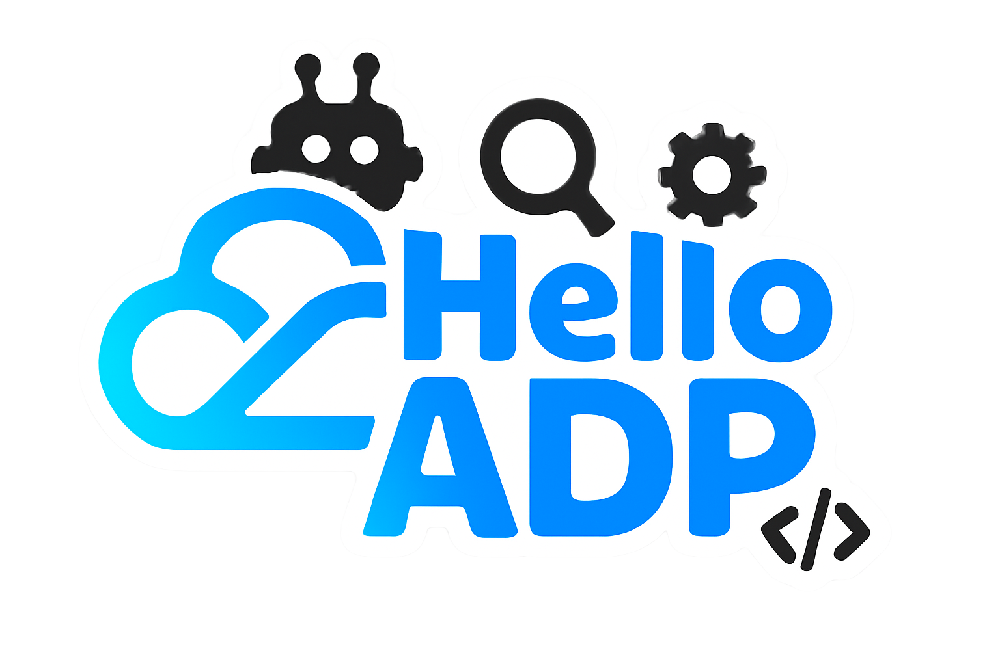

# Hello ADP

<p align="center">
  
</p>

<p align="center">
  A project designed to help newcomers quickly learn Tencent Cloud Agent Development Platform (ADP) through best practices.
</p>

<p align="center">
  <a href="https://hello-adp.com">Visit Now</a>
  ·
  <a href="https://github.com/stvlynn/hello-adp/issues">Report Bug</a>
  ·
  <a href="https://github.com/stvlynn/hello-adp/issues">Request Feature</a>
</p>

## What is this?

Hello ADP is a documentation of best practices for [Tencent Cloud ADP](https://adp.tencentcloud.com/). 

Tencent Cloud Agent Development Platform (ADP) is an enterprise-grade platform for building agent applications. It provides a variety of AI agent development frameworks, including **LLM+RAG**, **Workflow**, and **Multi-agent**, along with API services, enabling faster and more efficient building and deployment of agent solutions across enterprise scenarios.


This documentation serves as:

- **Learning Resource**: A collection of tutorials and best practices for Tencent Cloud Agent Development Platform (ADP)
- **Reference Implementation**: A modern, responsive website demonstrating Fumadocs capabilities
- **Community Project**: A collaborative effort by Tencent Cloud ADP community members
- **Interactive Documentation**: Includes real-time interactive demos to help you learn by doing

## Features

- 🌐 **Multilingual Support**: Available in English and Chinese
- 📱 **Responsive Design**: Works seamlessly on desktop, tablet, and mobile devices
- 🔍 **Full-text Search**: Quickly find the content you need
- 🎨 **Modern UI**: Clean, accessible interface with dark mode support
- 📚 **Comprehensive Guides**: Step-by-step tutorials for beginners and advanced users

## Internationalization (i18n)

Hello ADP supports multiple languages through a well-structured internationalization system. To help contributors with the i18n process:

- **Cursor Rules Integration**: When using Cursor IDE, you can quickly access i18n guidelines by using `cursor rules:@i18n.mdc`
- **Streamlined Workflow**: This rule provides templates for translation and automates the meta.json configuration
- **File Naming Conventions**: Follow the pattern `filename.{lang}.mdx` for content files (e.g., `index.mdx`, `index.zh.mdx`)
- **Translation Status**: English content is considered the source of truth, with Chinese translations maintained in parallel

The i18n rule helps ensure consistent structure across all language versions while maintaining the unique linguistic nuances of each translation.

## Join Tencent Cloud ADP Community

| Twitter | Discord | Telegram | WhatsApp | YouTube |
|---------|---------|----------|----------|---------|
| [](https://x.com/TencentCloudADP) | [](https://discord.gg/QjqhkHQVVM) | [](https://t.me/tencentcloudadp) | [](https://chat.whatsapp.com/JVY58EeSFU8I82ZzN49PK6?mode=ems_copy_c) | [](https://www.youtube.com/@tencentcloudadp) |

## Project Structure

```
hello-adp/
├── app/                  # Next.js app directory
│   ├── [lang]/           # Multilingual route handling
│   ├── api/              # API routes
│   └── global.css        # Global styles
├── content/              # Documentation content (MDX files)
│   ├── docs/             # Main documentation
│   ├── plugin/           # Plugin-specific documentation
│   └── workflow/         # Workflow guides
├── public/               # Static assets
│   └── images/           # Image files
└── lib/                  # Shared utilities
    └── fumadocs/         # Documentation configuration
```

## Contributors

[](https://github.com/stvlynn/hello-adp/graphs/contributors)

Want to contribute? Check out our [contribution guidelines](content/docs/contributing.mdx).

## License

This project is licensed under [CC-BY-SA-4.0](./LICENSE).